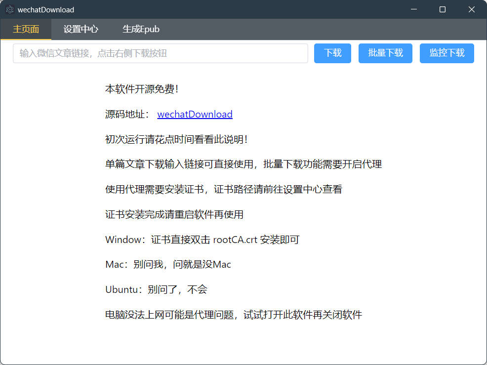
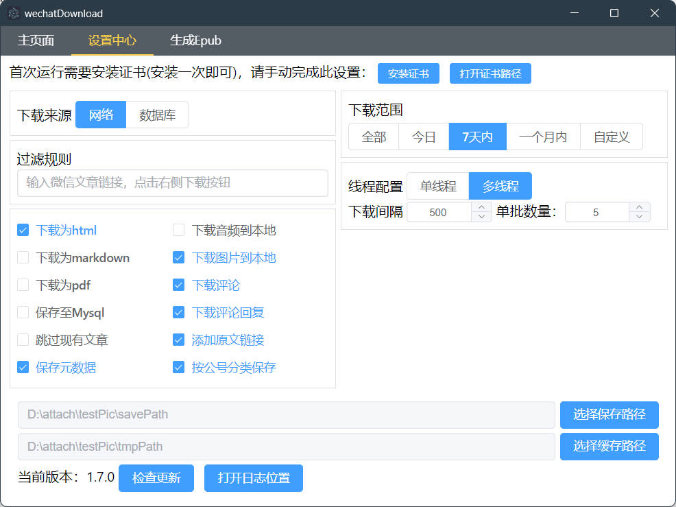
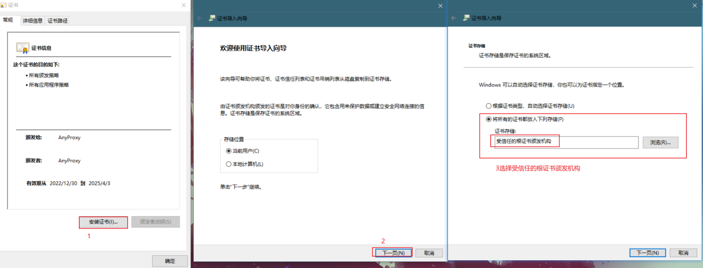
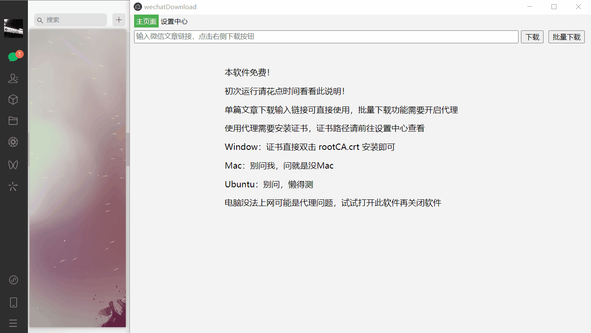
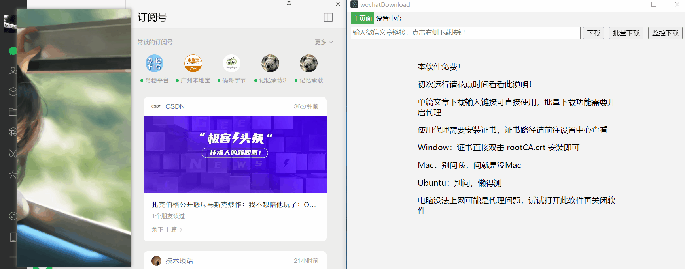

# wechatDownload

WeChat Official Account Article Download Tool

Original author's repository: https://github.com/xiaoguyu/wechatDownload

The original author has stopped updating. This repository was created using a non-fork method to add a simple translation implementation (for personal temporary needs). I will not maintain the original functionality. Please understand.

## Project Introduction

### Tech Stack

Electron + Typescript + VUE3

### Principle

To obtain the list of WeChat Official Account articles, 3 specific parameters are required:

- \_biz: The ID of the official account
- uin: The WeChat user's ID
- key: Unknown purpose

These 3 parameters are obtained via an HTTP proxy. The rest follows standard web scraping practices.

### Usage





- Single Article Download

  Simply enter the link and click the download button.

  This method does not require WeChat login, and therefore cannot fetch comments or QQ Music audio embedded in articles. If you need these two types of data, please use Batch Download or Monitor Download.

- Batch Download

  1. Please install the certificate on first use:

      - Auto-install (Windows only)

        Requires administrator privileges (Right-click the app icon -> Run as administrator)

        Settings Center -> Install Certificate

      - Manual installation

        Settings Center -> Open Certificate Path -> Open the rootCA.crt file
        

  2. WeChat PC client must be installed.

  3. Click the **Batch Download** button to start listening for official account data.

  4. Open an official account article you want to download in the WeChat PC client.

  5. Return to WechatDownload, a prompt dialog will appear:
      

- Monitor Download

  1. WeChat PC client must be installed.

  2. Click the **Monitor Download** button in WechatDownload (the button color will change).

  3. Open the articles you want to download in the WeChat PC client (multiple articles can be opened).

  4. Return to WechatDownload and click the **Monitor Download** button again to start the download.

     

- Save to MySQL

  You need to execute the SQL statements in the /doc/mysql.sql file to create the tables.

- Thread Configuration

  Time Interval: Measured in milliseconds. For example, if set to 500, single-threaded mode will wait 500ms after downloading one article before starting the next. Multi-threaded mode will asynchronously download articles every 500ms without waiting for the previous article to finish.

  Batch Size: For example, if set to 10, it will simultaneously and asynchronously download 10 articles per batch, wait for them to complete, and then proceed with the next 10.

- Filter Rules

  Currently supports keyword filtering for titles and authors.

  ```json
  {
      "title": {
          "include": ["包含关键词1", "包含关键词2"],
          "exclude": ["排除关键词1","排除关键词2"]
      },
      "auth": {
          "include": ["包含关键词1", "包含关键词2"],
          "exclude": ["排除关键词1", "排除关键词2"]
      }
  }
  ```

  For example, if you want the author to be 张三 (Zhang San) and the title to contain 好人 (Good Person), it would be:

  ```json
  {
      "title": {
          "include": ["好人"]
      },
      "auth": {
          "include": ["张三"]
      }
  }
  ```

- Generate Epub

  Supports generating Epub e-books from HTML files. Therefore, you must first use **Batch Download** to save the official account articles locally before generating the Epub.

  Usage parameters:

  - Filename: Required. For example, entering **test** will generate a **test.epub** file.
  - Folder: Required. The folder containing the HTML files, which serves as the data source for the Epub.
  - Cover Image: The cover image for the Epub file. Supports jpg and png formats.

### Features

Supports everything available in the Settings Center:

- Supports selecting download scope
- Converts webpages to HTML, Markdown, or PDF
- Saves webpage source code to MySQL (only effective when the download source is Network)
- Downloads images and audio to local storage
- Adds original link and metadata (author, date, official account name)
- Skips existing articles
- Downloads comments
- Download Source (this option only affects Batch Download):
  - Network: Fetches articles directly from the WeChat API.
  - Database: If the **Save to MySQL** option is selected, the database will store the webpage source code. If you need to convert the source code to HTML or Markdown, select Database as the download source. (Heavy use of the WeChat API may result in rate limiting)

## Running & Building from Source

### Install

```bash
$ npm install
```

### Debug

```bash
$ npm run dev
```

### Build

```bash
# For windows
$ npm run build:win

# For macOS
$ npm run build:mac

# For Linux
$ npm run build:linux
```

[//]: # (## Special Thanks)

[//]: # ()
[//]: # ([![]&#40;https://resources.jetbrains.com/storage/products/company/brand/logos/jb_beam.svg&#41;]&#40;https://www.jetbrains.com/?from=wechatDownload&#41;)

[//]: # ()
[//]: # (Thanks to [JetBrains]&#40;https://www.jetbrains.com/?from=wechatDownload&#41; for providing the open-source development license)
